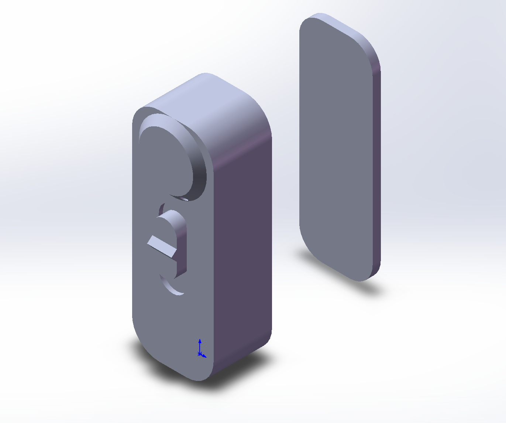

# Portable Stain Removal Device

A compact mechanical device designed for stain cleaning applications.

## 🔧 Features
- Compact and portable structure
- Simple mechanical design
- Basic housing and functional layout

## 🧠 Background
- Designed for a competition project
- Focused on usability and structural simplicity

## 🧩 Design Thinking
- Modular structure for easy assembly
- Rounded edges for ergonomics
- Balanced size between portability and usability

## 🖼️ Preview

